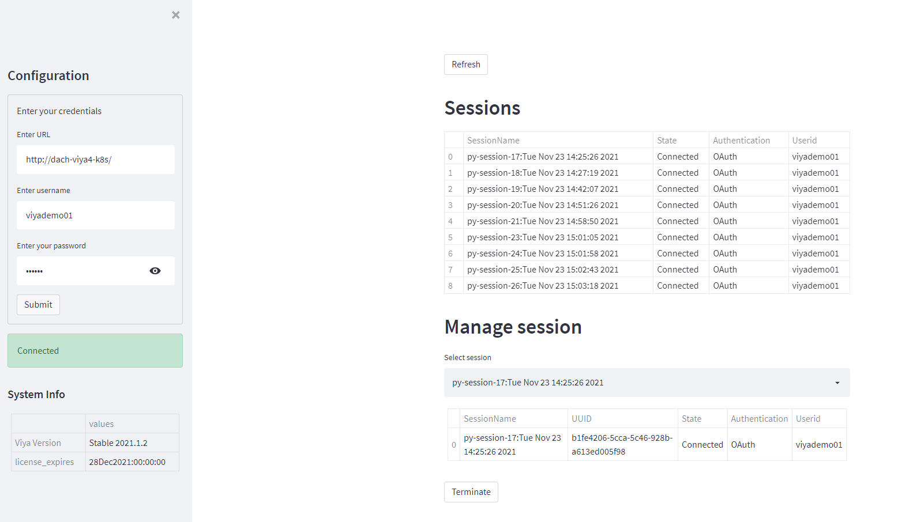

# sasviya-session-manager

A session manager for SAS Viya.



## How to run

1. Clone repository

2. Create python environment and activate
```
python -m venv venv
source venv/bin/activate
```

2. Install dependencies
```
pip install -r requirements.txt
```

3. run app
```
streamlit run src/app.py
```